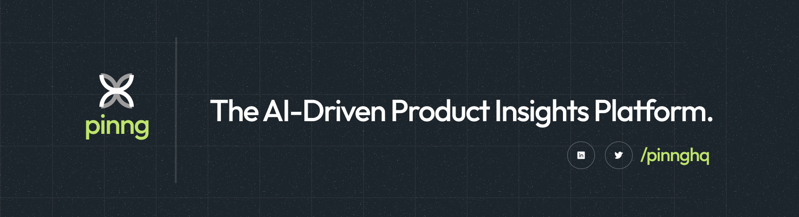

# Pinng

We've all been there - the frustration of building a product without knowing what your users *really* think. As both product creators and users ourselves, we understand the pain of sifting through scattered feedback and struggling to prioritize what matters most.

That's why we created Pinng.

Pinng is more than just a feedback tool; it's your product's dedicated listener. We bring together feedback from various sources, organizing it into a clear, actionable dashboard. With features like public and private feedback boards, scoring systems, public changelogs, and user heatmaps, you can easily identify trends, prioritize features, and make data-driven decisions.

Join us in making product development more human-centered. Let Pinng be your guide to building products that people love.

## Connect with us : 

- Follow us on [X](https://x.com/pinnghq) 🐤
- Follow us on [Linkedin](https://linkedin.com/company/pinnghq)
